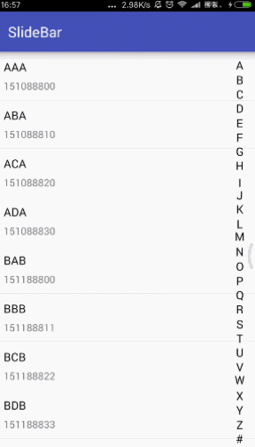

# SlideBar
[](https://raw.githubusercontent.com/jenly1314/SlideBar/master/app/app-release.apk)
[](https://jitpack.io/#jenly1314/SlideBar)
[](http://www.apache.org/licenses/LICENSE-2.0)
[](http://blog.csdn.net/jenly121)

SlideBar for Android 一个很好用的联系人快速索引。

## Gif 展示


## 引入

### Maven：
```maven
<dependency>
  <groupId>com.king.view</groupId>
  <artifactId>slidebar</artifactId>
  <version>1.1.0</version>
  <type>pom</type>
</dependency>
```
### Gradle:
```gradle
compile 'com.king.view:slidebar:1.1.0'
```
### Lvy:
```lvy
<dependency org='com.king.view' name='slidebar' rev='1.1.0'>
  <artifact name='$AID' ext='pom'></artifact>
</dependency>
```

#### 如果Gradle出现compile失败的话在Project的build.gradle里面请添加（也通过可以使用上面的gitpack来complie）
```gradle
allprojects {
    repositories {
        maven { url 'https://dl.bintray.com/jenly/maven' }
    }
}
```

具体实现详情请戳[传送门](http://blog.csdn.net/jenly121/article/details/48466641)


## 关于我
   Name: Jenly

   Email: jenly1314@gmail.com / jenly1314@vip.qq.com

   CSDN: http://blog.csdn.net/jenly121

   Github: https://github.com/jenly1314

   微信公众号:

   

## License

    Copyright © 2015, 2016 Jenly Yu 

    Licensed under the Apache License, Version 2.0 (the "License");
    you may not use this file except in compliance with the License.
    You may obtain a copy of the License at

       http://www.apache.org/licenses/LICENSE-2.0

    Unless required by applicable law or agreed to in writing, software
    distributed under the License is distributed on an "AS IS" BASIS,
    WITHOUT WARRANTIES OR CONDITIONS OF ANY KIND, either express or implied.
    See the License for the specific language governing permissions and
    limitations under the License.

